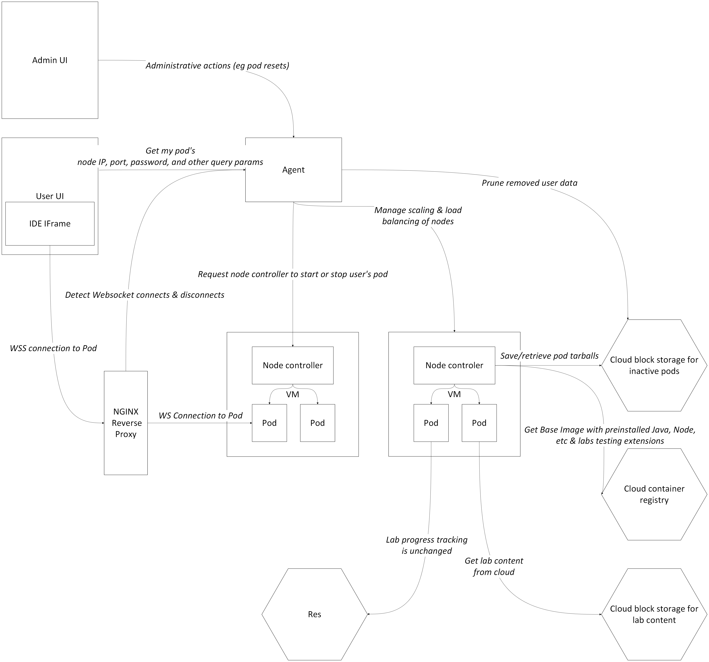

# Pod alternatives
I propose to replace gitpod with a self-host dockerized code-server containers delivered via a reverse proxy.

https://github.com/coder/code-server

Code-server is a browser based VSCode that functions effectively identically to gitpod. The code-server delivers a single instance of the IDE (with a sudo access terminal) on a websocket, which is crucial info for the project specs below. The code-server project is open source and regularly maintained by the coder organization. This is the best solution because other solutions typically require a cost per-user with some obtuse auth method (such as github for gitpod) or is otherwise a subscription method that would be way too expensive (redhat devbox). Because we are already building this infra for labs, I would also like to use the pods for general training coding, so that everyone uses the same environments without the need for setup. This would reduce a the burden of getting environments running for the training which usually takes a couple of days.

The coder organization that maintains the code-server project has an enterprise version of the project where the IDE is accessed from their UI; but on top of being expensive, the IDE isn't directly accessed from a link, which is what we would rather have for our Revpro integration.

## Orchestration

The most significant problem for us to solve is the management of multiple containers. Our natural instinct is to use Kubernetes, but there is a key deficiency in that system: we have no access to stopped pods. We can not move the contents of a pod to cloud storage. I listed some workarounds to this problem below.
### Option 1: K8 DinD
I tried bypassing these issues first by running the pods as a sysbox DinD container. This allows an outer managerial container to control the inner container. The outer pod will evict & save the pod when required. When attempting this route, I ran into issues with container isolation, where I failed to run Docker-in-Docker-in-Docker securely using sysbox to allow for Docker functionality within the container, and overall this matroshka doll nesting seemed like an excessively cumbersome solution. I believe that Gitpod was doing something similar to this when they were still using K8, since their documentation specifies an extra "isolation layer" around the pod.
### Option 2: K8 Volumes
Alternatively, we could try saving all user work in volumes. This would allow us to properly leverage more of Kubernetes functionality, since we can just reattach a volume to a fresh pod when a user requests one. We would need to use PersistentVolumes so that we have write access, access after pod killing, and access across nodes. Since we can expect to have potentially hundreds or thousands of users on the pods, we would need to maintain several terrabytes of volume space (eg 2 gb for all labs and projects * 1000 users in revpro). I have not tested this scale in K8, but I believe that this level of scale would be more difficult to manage than saving contents on S3 / Blob. This also presents a problem wherein all of the user's installs and environment variables on the pod would be cleared every time the user accessed their pod a new time, since the only files that get saved are those reflecting lab progress. This is a major downside for which no solution seems to exist.

### Option 3: Custom orchestrator

We can manage orchestration using any cloud SDK ourselves. Ultimately, this is the same approach that Gitpod ended up taking, and the Gitpod developers wrote on why they felt kubernetes was subpar for pods here: https://www.gitpod.io/blog/we-are-leaving-kubernetes

Managing our own orchestration/scaling is a daunting task, but our real objective here is not to create a particularly efficient orchestration, but just to make saving pods feasible. So, for the POC, I would not even worry about ever scaling down nodes (save for perhaps a rare case where a node happens to have zero pods) and focus only on scaling up. Scaling down would require complicated eviction behavior which is not provided by an existing autoscaling solution since our application is extremely stateful (ie we would need to either wait for all pods to stop or gracefully stop them). I personally think this is the most attractive option. 

The remainder of this document will be in reference to Option 3, although the main difference otherwise would be that a K8 option does not require us to write the node controller listed below.

## Here are the project components that I am envisioning:

### Pod
A single instance of code-server which is running in a docker container. Connecting to an already running pod such that the IDE UI is visible is a websocket connection. That means that launchin & using a pod is a two-step process: one request launches the pod, and provides IP & credentials for the pod, and the second connects to it. A pod will have all standard installs such as Java, as well as the Res testing extension, preinstalled by us as part of a custom Docker image.

### Agent
An API (Spring) which receives requests to spin up or spin down pods and sends them to the nodes controllers. The Agent may also handle some load balancing and autoscaling concerns. My reasoning for handling this ourselves instead of using an out-of-the-box solution is due to statefulness, explained later.

### Node controller
An API (Spring) replicated on each VM which receives requests from the Agent to manage the VM's pod containers. The containers can be managed directly using docker commands, which includes bash commands.

### Proxy
NGINX reverse proxy for connections to a pod after it has already been started.

## Monoworkspace or polyworkspace?

Code-server has the advantage of managing separate workspaces as file paths that can be accessed through different URLs without any issues. That simplifies the process of saving a user's lab contents as well as maintaining installs and environment variables across sessions. The user may also have several labs and personal projects open simultaneously without compute cost. The same pod may be reused for the entirety of the user's lifecycle at Revature. We can also just make the user's personal coding workspaces a separate file path (in fact, creating a "personal use" workspace could just be a lab with blank contents).

## Labs
Labs can be retrieved using the cloud storage method we are currently using, with the added benefit of being able to restrict access to the lab contents to only the IPs of the Nodes. 

We can also replace the CLI command used by the user with a bash command invoked on the container by the node controller, so the lab may be instantly loaded once the pod container is ready.

Because we are continuing to use VSCode, we should be able to continue using the current testing extension.

## Compute
The base resource usage of an idling pod should be estimated at about .2 VCPU & .5 GB RAM. Of course, this will be expected to spike when any code is ran, and we could cap containers at 1 VCPU & 2GB RAM.

## Security

- We will require auth from revpro to spin up a pod.
- We will secure web traffic by using the WSS protocol.
- We will use the sysbox docker runtime to securely permit docker-in-docker within the pod.
- Code-server can also solve one of the biggest problems of maintaining our own pod infra - making access to the pods secure. Ideally, we could auth with a password as a query param, as was attempted in this rejected pull request: https://github.com/coder/code-server/pull/6734, and we'll need to make this contribution to the project ourselves. Revpro will receive this password from the agent when a pod spins up, and the agent will start the pod with the specified password.
- The destination node IP, as well as any query parameters to be sent to the pod, may also be obfuscated and decrypted at the NGINX layer using a JS or Lua module. If additional security is desired, we could also encrypt them on a rotating key which is reset on the NGINX module on an interval.

## Spinup

The request to spin up a pod will come from revpro to the pod agent. whenever a user opens a lab. If the user has ever opened up their pod before, we'll pull their lab image from cloud storage and run it.

## Spindown

We should be able to detect socket events for when a user disconnects from the socket, allowing us to maintain the lifecycle of the pod automatically, and also autokill the pod on a timer. Every code-server will take up a significant amount of compute, so we should stop the containers when we detect a disconnection. I haven't tested if NGINX can handle this behavior as its ability to send requests is limited: if we can't do this, I would recommend (short term) simply killing all pods on a timer, or making a contribution to the code-server project that would allow us to ping it for active connections.

After the container is stopped, we can use docker to save the stopped container as a tar, send the tar to cloud storage, and run the tar again on spinup.